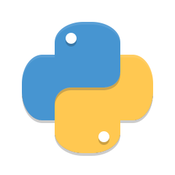
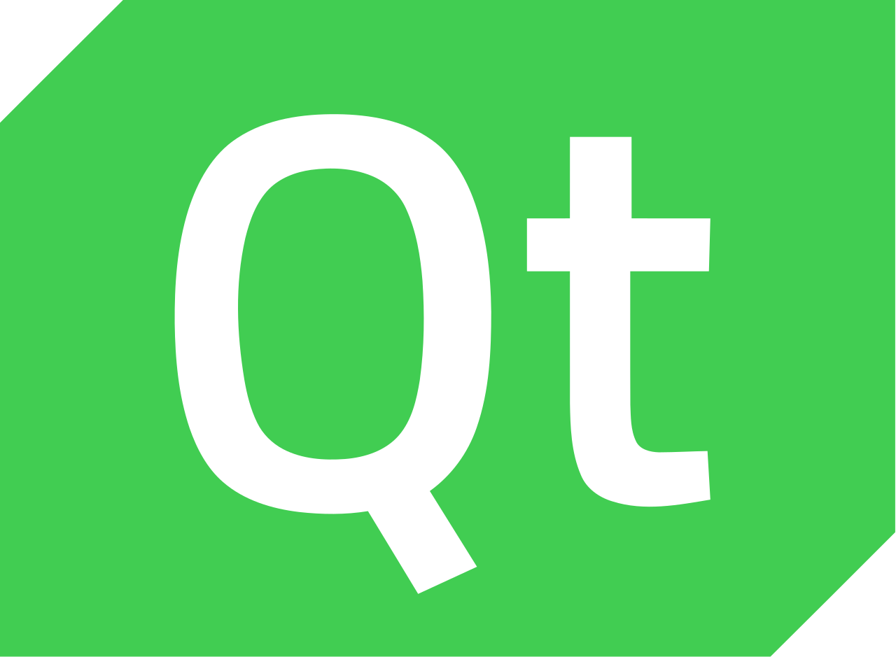
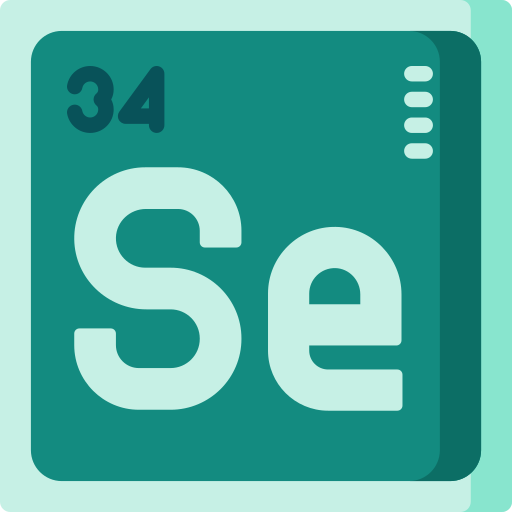

# Mofid Autotrader

  
  &nbsp;&nbsp;&nbsp;&nbsp;&nbsp;&nbsp;&nbsp;&nbsp;&nbsp;&nbsp;&nbsp;&nbsp;
  
  &nbsp;&nbsp;&nbsp;&nbsp;&nbsp;&nbsp;&nbsp;&nbsp;&nbsp;&nbsp;&nbsp;&nbsp;
  

  
   
   
</h1>

<h4 align="center">A minimal desktop app for auto trade on brokerage <a href="https://account.emofid.com/Login" target="_blank">mofid</a>.</h4>

  
  
  
  

</a>
  &nbsp;&nbsp;&nbsp;&nbsp;&nbsp;&nbsp;&nbsp;&nbsp;&nbsp;&nbsp;&nbsp;&nbsp;
  <a>

    
# توضیحات :
- این اپ فاقد هرگونه دیتابیس می باشد، بنابراین هیچ گونه اطلاعات کاربری از شما ذخیره نمی‌شود.
- برای تعین حجم مورد مورد نظر خود برای خرید ابتدا وارد حساب کاربری خود در اپلیکیشن مفید شود و حجم پیش فرض خرید را به تعداد سهمی که میخواهید بخرید تغییر دهید.
- اگر رمز کاربری یا نام کاربری خود را برای دفعه اول اشتباه وارد کرده باشید ، برای ورود در دفعات بعدی باید کد کپچا خواسته شده توسط سایت را به صورت دستی وارد کنید.
- گرفتن بهترین نتیجه برای سرخطی به عوامل متعددی از جمله سرعت اینترنت، پینگ اینترنت و ... بستگی دارد.
- برای تعیین زمان شروع سرخطی معمولا 5 ثانیه قبل از شروع تایم بازار زمان مناسبی است.(بازم بستگی به نت شما دارد)

